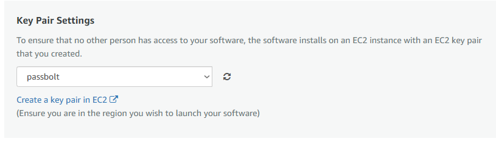

<h1 id="password-manager-hosted-on-aws-cloud-declan-worley">Password Manager Hosted on AWS Cloud | Declan Worley</h1>

<h2 id="objective">Objective:</h2>

To setup and configure Passbolt, an open-source password manager, on an AWS Ec2 Instance. In this lab, we will walk through my process of creating the EC2 instance, configuring Passbolt on the instance, and securing the traffic to our password manager with HTTPS.

<h4 id="systemssoftware-utilized-aws-ec2-instance-passbolt-ubuntu-24">Systems/Software Utilized: AWS EC2 Instance, Passbolt, Ubuntu 24</h4>
 
<h2 id="task-1-aws-instance-creation-and-setup">Task 1) AWS Instance Creation and Setup</h2>

Passbolt is an open-source password manager that helps users securely manage their passwords online. We can deploy this to AWS through the Passbolt Community Edition page on their website, and go through the instance setup as usual.

  

Here, we allow HTTP, HTTPS, and SSH. HTTP and HTTPS allows us to setup and configure Passbolt, while SSH is used to manage our virtual instance once it us up and running.

  

<h4 id="create-our-keypairs">Create our keypairs</h4>

Lastly in configuration, we need to create our keypairs to make sure access to our EC2 instance is secured. To do this, we can hop onto our Ubuntu host and generate a new keypair using <code class="inline-code">ssh-keygen -t rsa</code>, and copy the contents of the public key into our AWS dashboard (cat /home/ubuntu/.ssh/id_rsa.pub)

Once you have imported your public key from your Ubuntu machine, make sure to choose it under the <em>Key Pair Settings</em> dropdown in your Instance Creation menu. 
 
 

Now we can access Passbolt Web Interface by navigating to <code class="inline-code">http://54.159.245.100/install</code>. Currently, HTTP is being used to access our manager, however, we can set it up to use HTTPS so that our password traffic will not be in plain text.

  

<h2 id="task-2-https-configuration">Task 2) HTTPS configuration</h2>

HTTPS will be configured so that the traffic passing to our password manager will not be in plain text, but rather encrypted. To do this, we will need a domain name. For this example, I will be using declanworley.com on NameCheap. We can go to our Dashboard, click on the domain, and then navigate to <em>Advanced DNS</em> settings. Here we can create a new A Record:

  

There is also some configuration that needs to be completed on our Ubuntu host as well. I'll connect to the EC2 instance through SSH and I am greeted to instructions from passbolt regarding the SSL setup. It says here we need to edit our /etc/nginx/sites-enabled/nginx-passbolt.conf and modify the server_name to our domain. Then we can start the SSL configuration wizard by running `sudo dpkg-reconfigure passbolt-ce-server`.

  

<ol>
<li>

<strong>Configuring nginx-passbolt.conf</strong>

&Tab;

</li>
<li>

<strong>SSL configuration wizard.</strong>

</li>
</ol>

    

        
    

    

        
    

    

        
    

    

        
    

    

        
    

When we check back on our Passbolt dashboard, we can now access it at <a data-from-md title='https://declanworley.com' href='https://declanworley.com'>https://declanworley.com</a> and see that SSL access has now been enabled. Next, we will move on to finishing configuration.

 
<h3 id="task-3-completing-passbolt-setup-through-web-interface">Task 3) Completing Passbolt Setup through Web Interface</h3>

The rest of the Passbolt configuration is pretty straightforward. I will use the default settings for the database details, and supply some personal information, such as email and name, for the OpenPGP settings and SMTP server. I used my gmail for the SMTP settings, which allows users to receive important verification emails when creating an account, as well as providing forgot password features. A future project could involve setting up your own SMTP server, and using it for the emails used by this password manager.

<h3 id="setup-complete-lets-test-it">Setup Complete, Let's test it</h3>

I found out that Passbolt doesn't work well with Opera, but it supports Chrome, Edge, Firefox, and other popular browsers. For this lab, I will use the extension for Microsoft Edge. Next, you are guided to make a passphrase to access your Passbolt account, download your recovery kit in case of lost access, and making a security token. Here my test security token is a gray TST, this will help ensure you aren't on a phising page.

    

        
        

    

        
    

Once logged in, there is an empty password table. We can start using our new password manager by creating a password and supplying it with some information:

<ul>
<li>Name: A name to recognize your password.</li>
<li>URL: The site that the password will be used on. I will use LinkedIn as an example.</li>
<li>Username &amp; Password: Self-explanatory; you can supply your login information here, and it will be used to automatically fill out your login forms.</li>
</ul>

  

  

  

<h2 id="conclusion">Conclusion:</h2>

Password managers are an essnetial cybersecurity tool that you can utilize to protect your accounts across the internet. They allow you to easily vary your passwords from website to website, which in turn greatly lowers your risk of being hacked through data breaches. They are particularly important for companies where employees use multiple sites that aren't covered by single sign-on (SSO), as one leaked password won't grant malicious users access to other accounts.

By completing this lab, we successfully set up and secured a Passbolt password manager on an AWS EC2 instance, and configured it for HTTPS access. This process not only highlights the benefits of password managers but also the importance of securing web applications in general.

					</body>
				</html>
			
